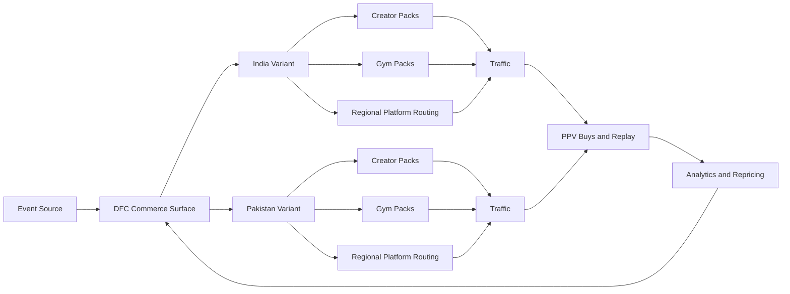
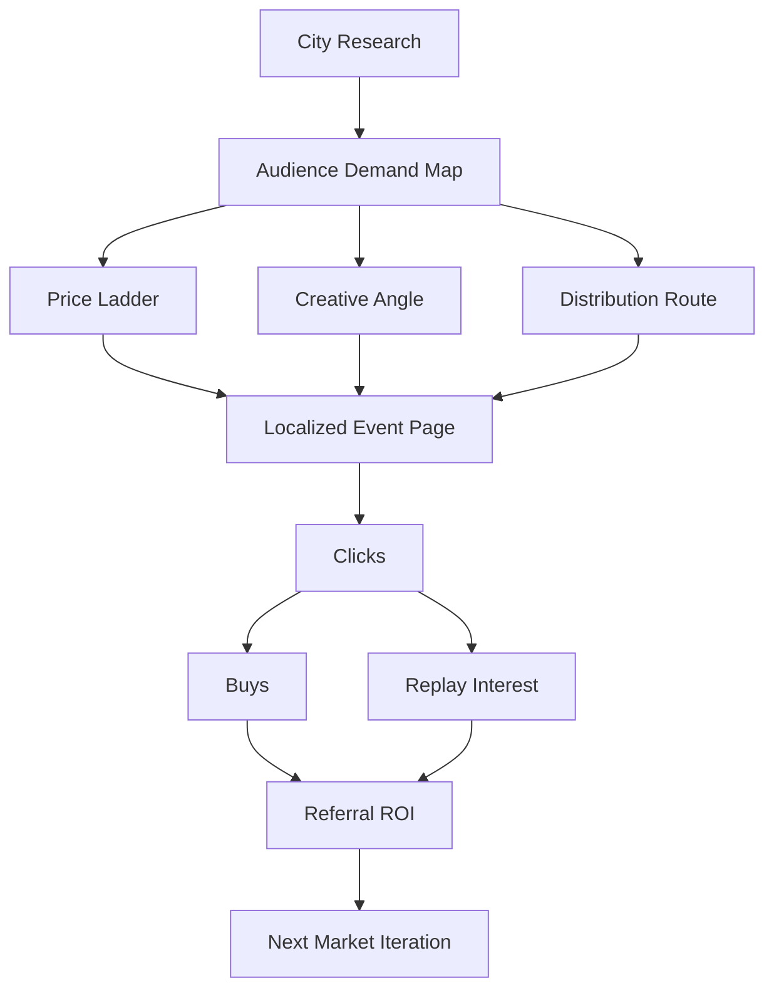
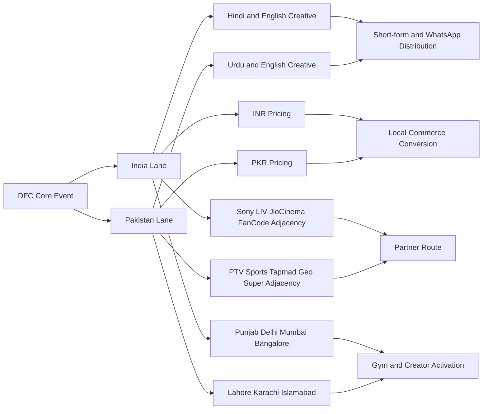

# DFC South Asia Pipeline And Diagrams

Status: implementation-facing pipeline for India and Pakistan commerce, marketing, research, and distribution.

## Pipeline

### Pipeline A: Research -> Offer -> Distribution

1. Research city, gym, creator, and platform demand.
2. Select commercial offer for the market.
3. Localize pricing and copy.
4. Generate market-specific launch packs.
5. Route through DFC, partner, creator, gym, and WhatsApp channels.
6. Measure clicks, buys, replay, and referrals.
7. Reprice and repackage based on conversion.

### Pipeline B: Event Commerce Flow

1. Source event identity and main card story.
2. Create India and Pakistan variants.
3. Attach INR and PKR pricing intent.
4. Build event page, replay promise, and direct CTA.
5. Push into creator and gym activation packs.
6. Drive to DFC PPV or partner route by market.
7. Capture replay retention and referral-driven sales.

## Diagram 1: South Asia Growth System

## Diagram 2: Market Research To Revenue Loop

## Diagram 3: India And Pakistan Operating Split

## What Must Be True In Product

1. India and Pakistan must exist as explicit markets in export and distribution logic.
2. Event pages must communicate local market relevance, not just global availability.
3. Replay and live offers must be priced and packaged for mobile-first users.
4. Creator and gym packs must be market-specific.
5. Analytics must report India and Pakistan separately, not as generic international traffic.

## Immediate Build Targets

1. India and Pakistan market routing in export engine.
2. South Asia quick preset in shipping center.
3. Region-aware watch surfaces that show South Asia as a growth lane.
4. India and Pakistan pricing and campaign reporting surfaces in promoter operations.
