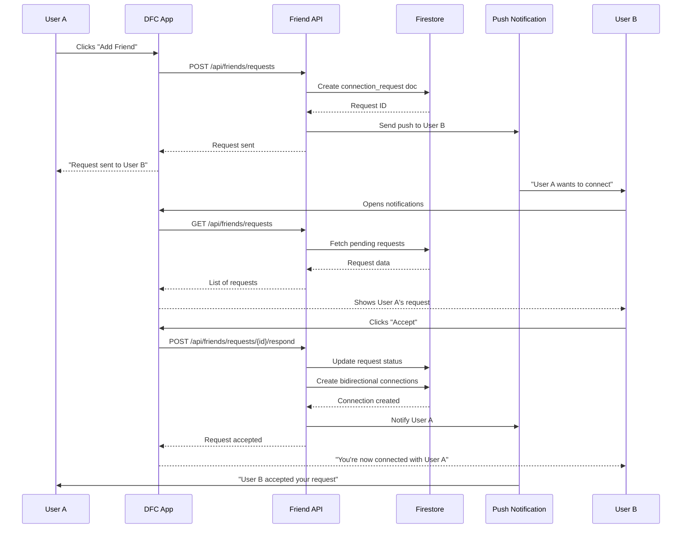
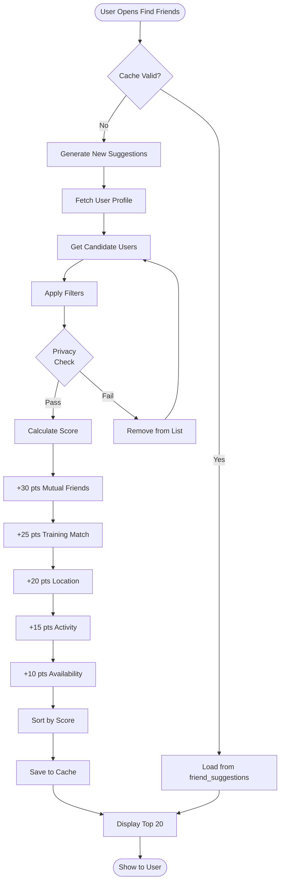
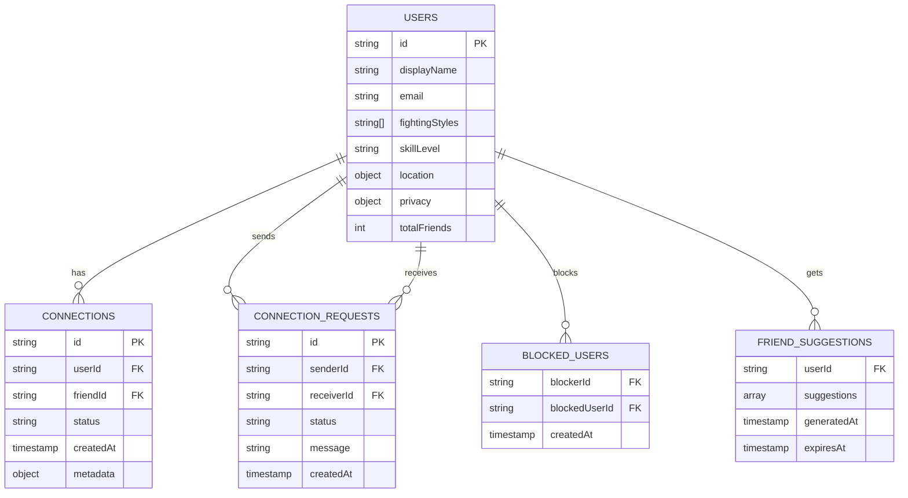
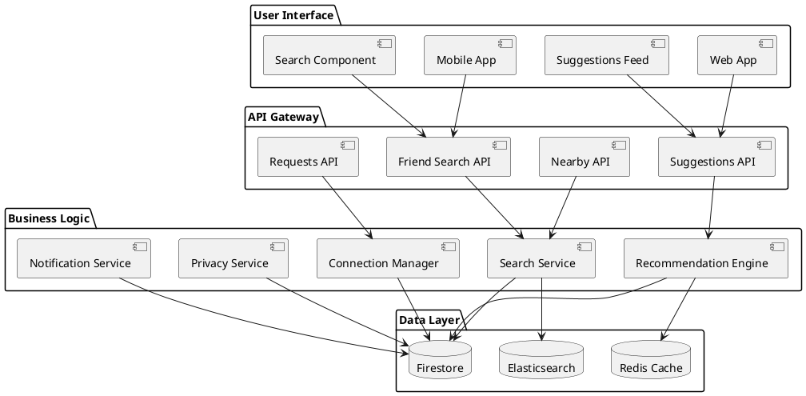
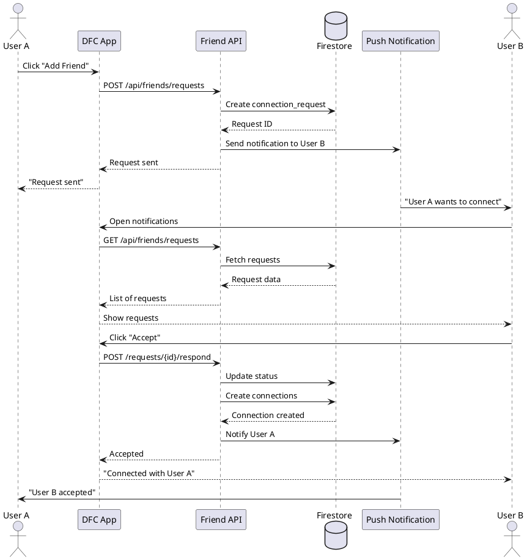

# Find Friends Visual Diagrams

This document contains various diagram formats for the Find Friends feature that can be used with different tools.

---

## Mermaid Diagram (Paste into GitHub, Notion, etc.)

### System Architecture

```mermaid
graph TB
    subgraph UI[User Interface Layer]
        A1[Mobile App]
        A2[Web App]
        A3[Search Bar]
        A4[Suggestions Feed]
        A5[Filter Panel]
    end

    subgraph API[API Gateway]
        B1[/api/friends/search]
        B2[/api/friends/suggestions]
        B3[/api/friends/requests]
        B4[/api/friends/nearby]
    end

    subgraph Logic[Business Logic]
        C1[Search Service]
        C2[Recommendation Engine]
        C3[Connection Manager]
        C4[Privacy Service]
        C5[Notification Service]
    end

    subgraph Data[Data Layer]
        D1[(Firestore)]
        D2[(Redis Cache)]
        D3[(Elasticsearch)]
    end

    A1 --> B1
    A2 --> B2
    A3 --> B1
    A4 --> B2
    A5 --> B1

    B1 --> C1
    B2 --> C2
    B3 --> C3
    B4 --> C1

    C1 --> D1
    C1 --> D3
    C2 --> D1
    C2 --> D2
    C3 --> D1
    C4 --> D1
    C5 --> D1
```

### Connection Request Flow



### Recommendation Algorithm Flow



### Data Model Relationships



---

## Draw.io XML (Copy and import into draw.io)

```xml
<mxfile host="app.diagrams.net">
  <diagram name="Find Friends Architecture">
    <mxGraphModel dx="1422" dy="794" grid="1" gridSize="10" guides="1">
      <root>
        <mxCell id="0"/>
        <mxCell id="1" parent="0"/>

        <!-- User Interface Layer -->
        <mxCell id="2" value="User Interface Layer" style="rounded=1;whiteSpace=wrap;fillColor=#dae8fc;strokeColor=#6c8ebf;fontSize=14;fontStyle=1" vertex="1" parent="1">
          <mxGeometry x="80" y="40" width="640" height="60" as="geometry"/>
        </mxCell>

        <!-- API Gateway -->
        <mxCell id="3" value="API Gateway" style="rounded=1;whiteSpace=wrap;fillColor=#d5e8d4;strokeColor=#82b366;fontSize=14;fontStyle=1" vertex="1" parent="1">
          <mxGeometry x="80" y="140" width="640" height="60" as="geometry"/>
        </mxCell>

        <!-- Business Logic -->
        <mxCell id="4" value="Business Logic Layer" style="rounded=1;whiteSpace=wrap;fillColor=#fff2cc;strokeColor=#d6b656;fontSize=14;fontStyle=1" vertex="1" parent="1">
          <mxGeometry x="80" y="240" width="640" height="120" as="geometry"/>
        </mxCell>

        <!-- Data Layer -->
        <mxCell id="5" value="Data Layer" style="rounded=1;whiteSpace=wrap;fillColor=#f8cecc;strokeColor=#b85450;fontSize=14;fontStyle=1" vertex="1" parent="1">
          <mxGeometry x="80" y="400" width="640" height="60" as="geometry"/>
        </mxCell>

        <!-- Connections -->
        <mxCell id="6" value="" style="endArrow=classic;html=1;" edge="1" parent="1" source="2" target="3">
          <mxGeometry width="50" height="50" relative="1" as="geometry"/>
        </mxCell>
        <mxCell id="7" value="" style="endArrow=classic;html=1;" edge="1" parent="1" source="3" target="4">
          <mxGeometry width="50" height="50" relative="1" as="geometry"/>
        </mxCell>
        <mxCell id="8" value="" style="endArrow=classic;html=1;" edge="1" parent="1" source="4" target="5">
          <mxGeometry width="50" height="50" relative="1" as="geometry"/>
        </mxCell>
      </root>
    </mxGraphModel>
  </diagram>
</mxfile>
```

---

## PlantUML (Paste into PlantUML editor)

### Component Diagram



### Sequence Diagram



---

## ASCII Diagram (Terminal/Text-friendly)

```
┌─────────────────────────────────────────────────────────────────┐
│                      FIND FRIENDS SYSTEM                         │
└─────────────────────────────────────────────────────────────────┘

┌─────────────────────────────────────────────────────────────────┐
│  LAYER 1: USER INTERFACE                                         │
├─────────────────────────────────────────────────────────────────┤
│                                                                  │
│   [Mobile App]    [Web App]    [Search]    [Suggestions]       │
│                                                                  │
└────────────────────┬────────────────────────────────────────────┘
                     │
                     ▼
┌─────────────────────────────────────────────────────────────────┐
│  LAYER 2: API GATEWAY                                            │
├─────────────────────────────────────────────────────────────────┤
│                                                                  │
│   /search     /suggestions     /requests     /nearby            │
│                                                                  │
└────────────────────┬────────────────────────────────────────────┘
                     │
                     ▼
┌─────────────────────────────────────────────────────────────────┐
│  LAYER 3: BUSINESS LOGIC                                         │
├─────────────────────────────────────────────────────────────────┤
│                                                                  │
│   ┌──────────┐  ┌──────────┐  ┌──────────┐  ┌──────────┐      │
│   │ Search   │  │  Reco    │  │  Conn    │  │ Privacy  │      │
│   │ Service  │  │ Engine   │  │ Manager  │  │ Service  │      │
│   └──────────┘  └──────────┘  └──────────┘  └──────────┘      │
│                                                                  │
└────────────────────┬────────────────────────────────────────────┘
                     │
                     ▼
┌─────────────────────────────────────────────────────────────────┐
│  LAYER 4: DATA                                                   │
├─────────────────────────────────────────────────────────────────┤
│                                                                  │
│   [Firestore]        [Redis Cache]       [Elasticsearch]        │
│                                                                  │
└─────────────────────────────────────────────────────────────────┘
```

---

## Lucidchart JSON (Import into Lucidchart)

```json
{
  "version": "1.0",
  "title": "Find Friends Architecture",
  "shapes": [
    {
      "id": "ui_layer",
      "type": "rectangle",
      "text": "User Interface Layer",
      "x": 100,
      "y": 50,
      "width": 600,
      "height": 80,
      "fill": "#dae8fc",
      "stroke": "#6c8ebf"
    },
    {
      "id": "api_layer",
      "type": "rectangle",
      "text": "API Gateway",
      "x": 100,
      "y": 180,
      "width": 600,
      "height": 80,
      "fill": "#d5e8d4",
      "stroke": "#82b366"
    },
    {
      "id": "logic_layer",
      "type": "rectangle",
      "text": "Business Logic",
      "x": 100,
      "y": 310,
      "width": 600,
      "height": 120,
      "fill": "#fff2cc",
      "stroke": "#d6b656"
    },
    {
      "id": "data_layer",
      "type": "rectangle",
      "text": "Data Layer",
      "x": 100,
      "y": 480,
      "width": 600,
      "height": 80,
      "fill": "#f8cecc",
      "stroke": "#b85450"
    }
  ],
  "connections": [
    { "from": "ui_layer", "to": "api_layer", "type": "arrow" },
    { "from": "api_layer", "to": "logic_layer", "type": "arrow" },
    { "from": "logic_layer", "to": "data_layer", "type": "arrow" }
  ]
}
```

---

## Canva Presentation Outline

### Slide 1: Title

- **Title:** Find Friends - Smart Discovery System
- **Subtitle:** Connect fighters, coaches, and training partners
- **Background:** Combat sports collage

### Slide 2: Problem Statement

- Left: Pain points ("Hard to find training partners", "Gyms feel isolated")
- Right: Solution ("AI-powered matching", "Location-based discovery")

### Slide 3: Core Features

- 🔍 Smart Search (by style, level, location)
- 🤖 AI Suggestions (mutual friends, compatibility)
- 📍 Nearby Fighters (geo-search)
- 🔒 Privacy Controls (discoverable settings)

### Slide 4: System Architecture

- Use the 4-layer diagram above
- Annotate each layer with key components

### Slide 5: User Flow

- Search → Filter → Add Friend → Accept → Connected
- Show mobile mockup wireframe

### Slide 6: Recommendation Algorithm

- Visualization of scoring factors (pie chart):
  - 30% Mutual Connections
  - 25% Training Match
  - 20% Proximity
  - 15% Activity
  - 10% Availability

### Slide 7: Success Metrics

- Target: 70% of new users make 1+ connection in 7 days
- 50% suggestion click-through rate
- 80% friend request acceptance rate

### Slide 8: Roadmap

- Phase 1: Core search (Weeks 1-2)
- Phase 2: Recommendations (Weeks 3-4)
- Phase 3: AI scoring (Weeks 5-6)
- Launch: Week 8

---

## How to Use These Diagrams

### For draw.io

1. Go to https://app.diagrams.net
2. Click "Import"
3. Paste the Draw.io XML above
4. Edit colors, layout, and labels

### For Mermaid (GitHub, Notion)

1. Copy the Mermaid code blocks
2. Paste into GitHub markdown or Notion
3. Diagrams render automatically

### For PlantUML

1. Go to https://www.plantuml.com/plantuml/
2. Paste PlantUML code
3. Download as PNG/SVG

### For Lucidchart

1. Go to https://lucid.app
2. Import JSON
3. Customize and share

### For Canva

1. Go to https://canva.com
2. Create new presentation
3. Follow the slide outline above
4. Use DFC brand colors (neon green/blue)

---

**Ready to visualize!** Pick your tool and start diagramming. 🚀
