# DFC SOCIAL PLATFORM WORKFLOW DIAGRAMS

**Visual representation of content flow across all social platforms**

---

## DIAGRAM 1: Complete Content Distribution Pipeline

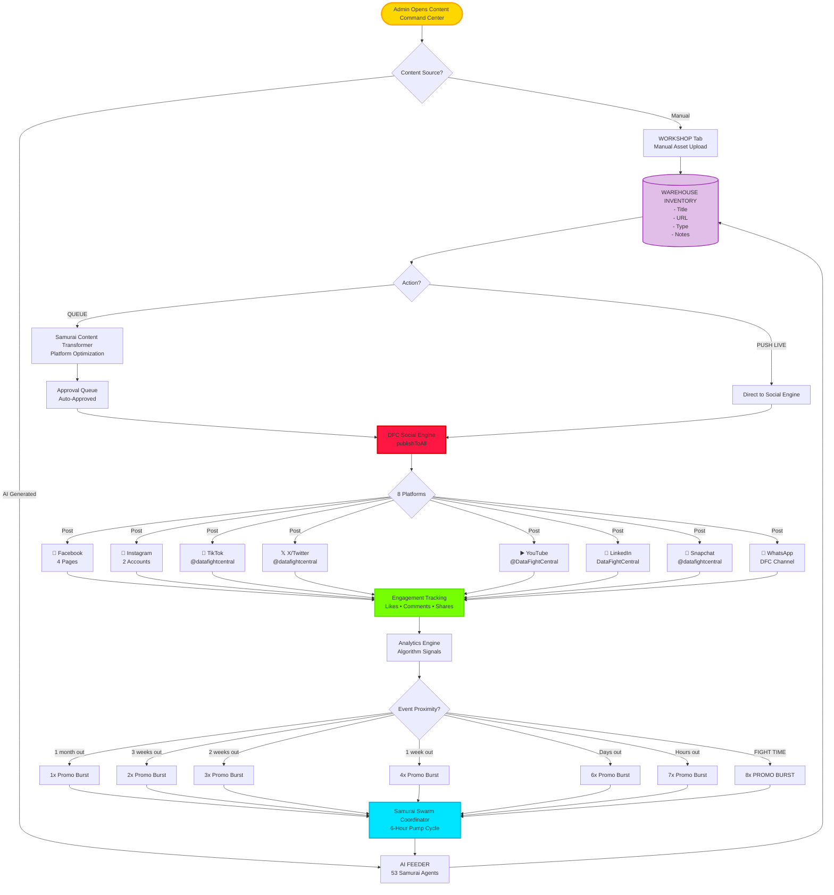

---

## DIAGRAM 2: Platform-Specific Action Workflows

### Facebook User Journey

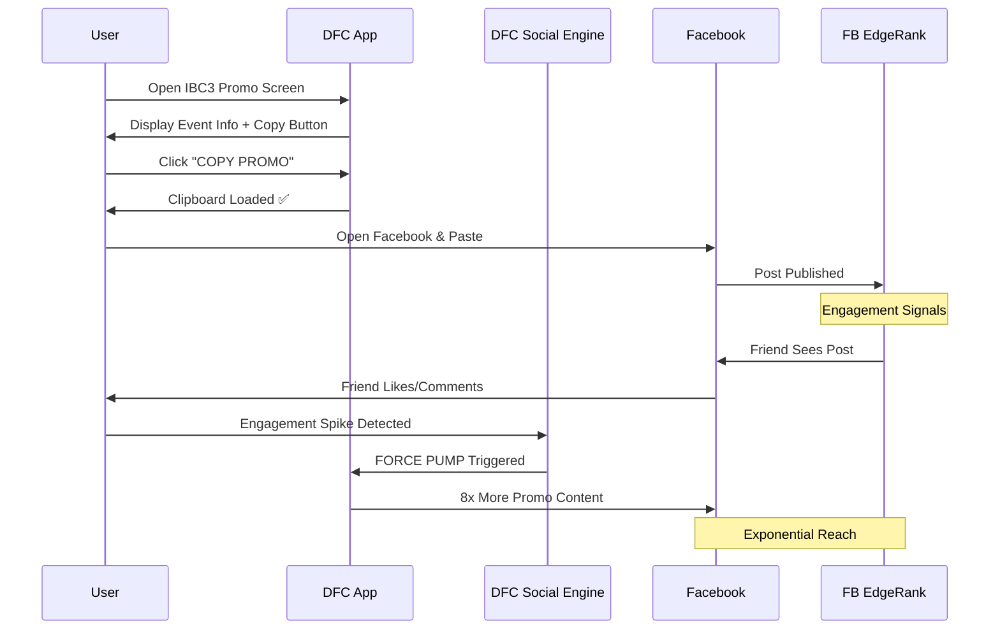

### Instagram Story/Reels Flow

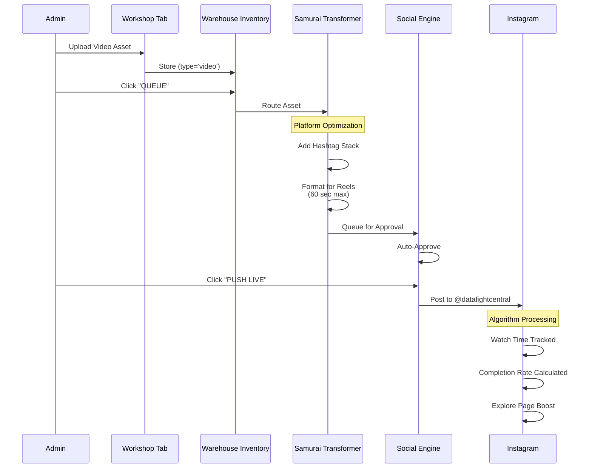

### TikTok For You Page Optimization

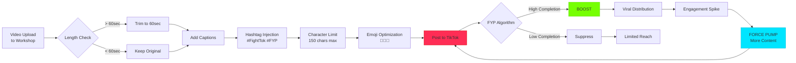

### X/Twitter Intent Flow

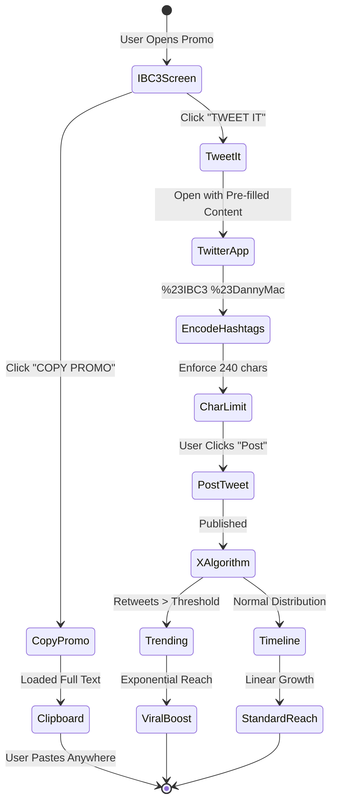

---

## DIAGRAM 3: Event-Proximity Hype Ramp System

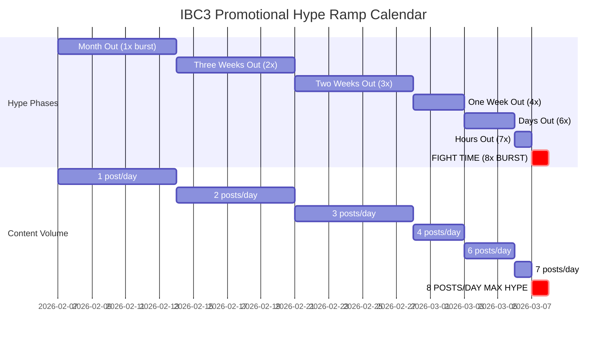

---

## DIAGRAM 4: Algorithm Engagement Decision Tree

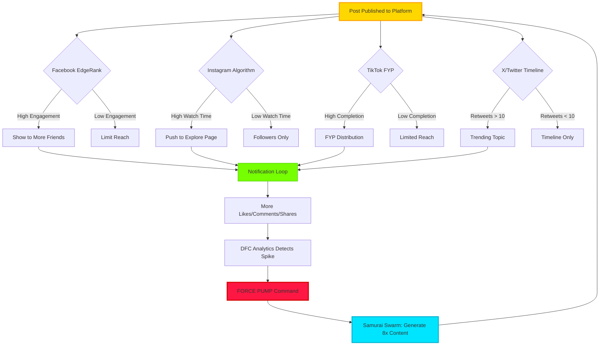

---

## DIAGRAM 5: IBC3 One-Click Distribution Architecture

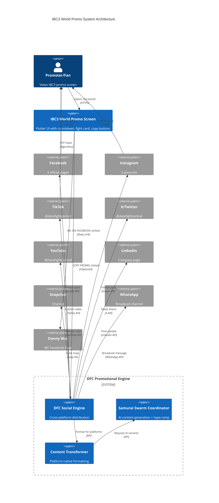

---

## DIAGRAM 6: Content Rotation Engine (6-Hour Windows)

```mermaid
timeline
    title 24-Hour Content Rotation Cycle
    section Midnight
        00:00 : Window A Opens
              : Fight Highlights
              : Main Event Promos
    section Morning
        06:00 : Window B Opens
              : Training Content
              : Fighter Spotlights
    section Midday
        12:00 : Window C Opens
              : Event Announcements
              : Ticket Sales
    section Evening
        18:00 : Window D Opens
              : Live Fight Coverage
              : PPV Reminders
    section Next Cycle
        00:00 : Window A Repeats
              : Content Rotation Resets
```

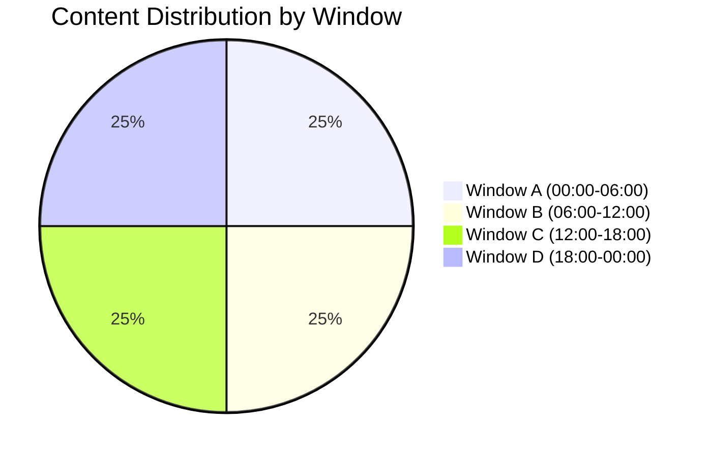

---

## DIAGRAM 7: Workshop Asset Routing Pipeline

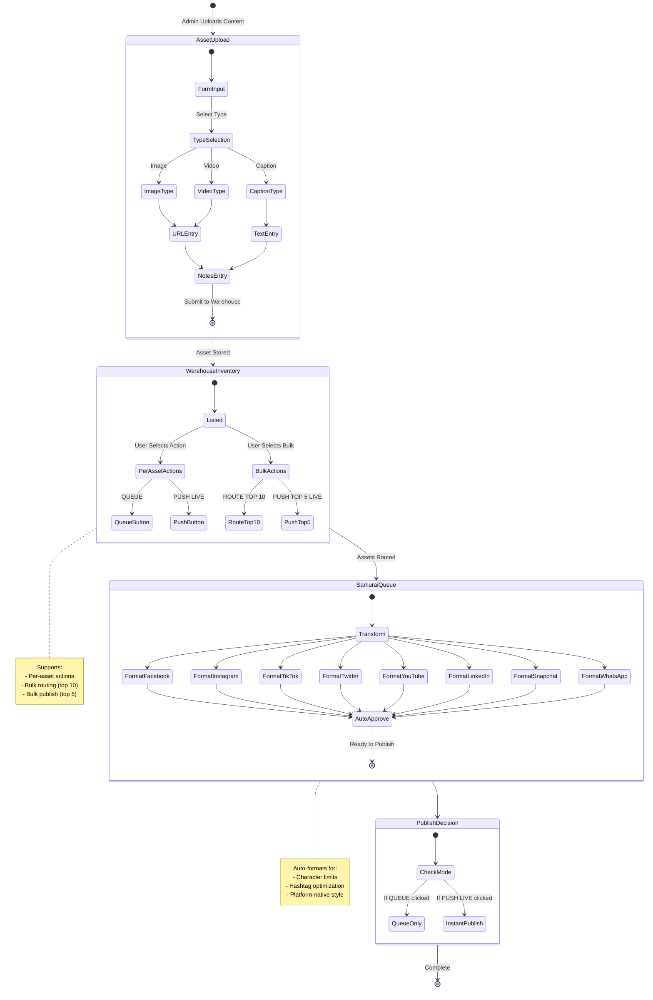

---

## DIAGRAM 8: Notification Feedback Loop

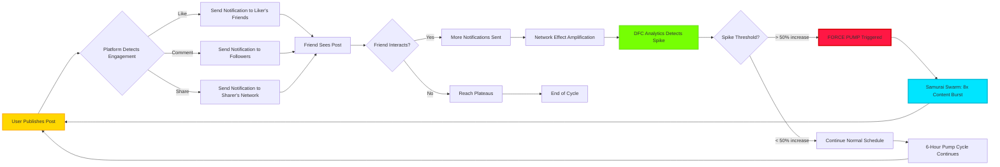

---

## DIAGRAM 9: Platform Algorithm Characteristics

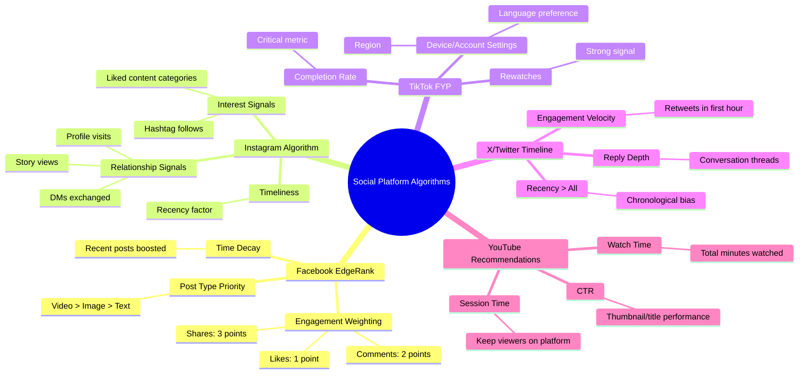

---

## DIAGRAM 10: Cross-Platform Hashtag Strategy

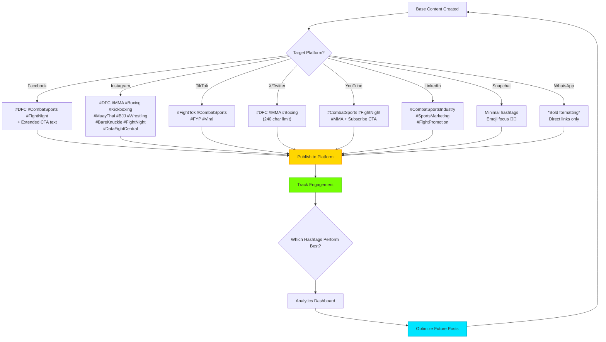

---

## LEGEND

### Symbols Used

- **Rectangle:** Action/Process
- **Diamond:** Decision Point
- **Parallelogram:** Input/Output
- **Circle:** Start/End
- **Cylinder:** Database/Storage
- **Rounded Rectangle:** Subprocess
- **Arrow:** Flow Direction

### Color Coding

- 🟡 **Gold (#FFD700):** User Actions / Input
- 🔴 **Red (#FF1744):** Critical Processes / FORCE PUMP
- 🔵 **Cyan (#00E5FF):** AI Automation / Swarm Activities
- 🟢 **Green (#76FF03):** Engagement Tracking / Success States
- 🟣 **Purple (#9C27B0):** Data Storage / Warehouse

---

## USAGE INSTRUCTIONS

### Viewing Diagrams in VS Code

1. Install "Markdown Preview Mermaid Support" extension
2. Open this file in VS Code
3. Press `Ctrl+Shift+V` to open preview pane
4. Diagrams will render interactively

### Exporting for Presentations

**Option 1: Use Mermaid Live Editor**

1. Copy diagram code block
2. Paste into https://mermaid.live
3. Export as PNG/SVG

**Option 2: Use VS Code Screenshot**

1. Open preview pane
2. Take screenshot of rendered diagram
3. Include in PowerPoint/Keynote

**Option 3: GitHub Rendering**

1. Commit this file to GitHub
2. GitHub automatically renders Mermaid diagrams
3. Share link with stakeholders

---

**All diagrams represent production systems currently deployed in DataFightCentral.**

**For Danny Mac:** These workflows power the IBC3 promotional engine you saw in action. Each diagram maps to real code in the DFC codebase.

---

**Document Version:** 1.0  
**Last Updated:** March 8, 2026  
**Maintained By:** DFC Development Team
