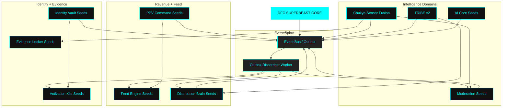

# DFC Superbeast Blueprint

```mermaid
flowchart TD
    classDef core fill:#0ff,stroke:#0ff,stroke-width:2px,color:#000;
    classDef domain fill:#111,stroke:#0ff,stroke-width:1.5px,color:#0ff;
    classDef infra fill:#222,stroke:#0ff,stroke-width:1.5px,color:#0ff;

    A[DFC SUPERBEAST CORE]:::core

    subgraph Spine[Event Spine]
        EB[Event Bus / Outbox]:::infra
        OW[Outbox Dispatcher Worker]:::infra
    end

    subgraph Intelligence[Intelligence Domains]
        SF[Chukya Sensor Fusion]:::domain
        TRIBE[TRIBE v2]:::domain
        AI[AI Core Seeds]:::domain
        MOD[Moderation Seeds]:::domain
    end

    subgraph Revenue[Revenue + Feed]
        PPV[PPV Command Seeds]:::domain
        FEED[Feed Engine Seeds]:::domain
        DIST[Distribution Brain Seeds]:::domain
    end

    subgraph Trust[Identity + Evidence]
        ID[Identity Vault Seeds]:::domain
        EVID[Evidence Locker Seeds]:::domain
        ACT[Activation Kits Seeds]:::domain
    end

    A --> EB
    EB --> OW

    SF --> EB
    TRIBE --> EB
    AI --> EB
    MOD --> EB
    PPV --> EB
    ID --> EB
    DIST --> EB

    OW --> FEED
    OW --> MOD
    OW --> DIST
    OW --> ACT

    PPV --> FEED
    TRIBE --> DIST
    SF --> MOD
    ID --> ACT
    SF --> EVID
```

This diagram is the working blueprint for the current DFC backend shape after the sensor-fusion, TRIBE, and event-spine upgrades plus the new seed domains.
