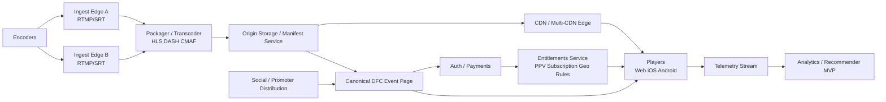

# DFC Multi-Region Streaming Blueprint

Version: 2026-04-18
Status: Target-state blueprint aligned to current repo doctrine
Audience: product, platform, streaming, PPV, SRE, promoter operations

Related:

- `docs/architecture/dfc_one_page_architecture.svg`
- `docs/architecture/dfc_ppv_system_snapshot.md`
- `docs/runbooks/DFC_PPV_LIVE_EVENT_OPS_RUNBOOK.md`

## Purpose

This document turns DFC's streaming direction into one executable platform standard.

It is designed to keep DFC lean while still behaving like a serious fight platform:

- multi-region capable
- PPV-safe
- promoter-first
- social-aware
- operationally disciplined

This is not permission to add a second or third entitlement stack.
This blueprint must stay aligned with the current repo truth:

- Firebase plus GCP remains the control plane
- Mux remains the strongest current streaming authority
- DFC-owned playback remains the canonical paid watch surface
- checkout and entitlement authority must converge, not multiply

## Platform Position

DFC should not try to copy the full overhead of UFC Fight Pass or Paramount+.
DFC should copy the parts that create trust and resilience:

- dual-path ingest
- ABR packaging and tuned delivery
- server-side entitlement checks before playback
- multi-region readiness for major events
- device-parity player behavior
- operational discipline around rollouts, failover, and replay readiness

DFC's differentiator is not generic scale. DFC's differentiator is combat-native operations plus promoter growth.

That means the platform must join three lanes into one operating system:

- premium watch and PPV
- promoter distribution and promotion
- social discovery and audience conversion

## Non-Negotiable Rules

1. DFC-owned event pages, pricing, checkout, entitlement, watch, replay, and analytics remain canonical.
2. Social platforms are acquisition lanes, not the paid watch authority.
3. Product chrome for PPV, checkout, and entitlements stays restrained and professional.
4. Any playful or gamified layer is gated to discovery, community, or social surfaces.
5. No new purchase, token, or playback authority may be introduced until one entitlement authority is declared canonical.
6. Regional independence matters: no region should require another region to stay healthy for core playback authorization.

## Compact Architecture View

### High-level flow

Encoders -> Ingest Edge -> Packager / Transcoder -> Origin / Manifest Service -> Multi-CDN Edge -> Player (Web / iOS / Android / TV)

Auth / Payments -> Canonical PPV Access / Entitlements -> Player

Telemetry -> Stream Processor -> Analytics / Recommender

### ASCII view

```text
[ENCODERS]
    └─(RTMP/SRT)→ [INGEST EDGE PoP A/B] ──┐
                                                      ├─> [PACKAGER / TRANSCODER] ──> [ORIGIN / MANIFEST]
                                                      │                                     │
                                                      │                                     └─> [Multi-CDN / Edge] ──> [PLAYER]
                                                      │
[AUTH / PAYMENTS] ──> [CANONICAL PPV ACCESS / ENTITLEMENTS] ──> (valid?) ──> [PLAYER]
                                                      │
[TELEMETRY] ──> [STREAM PROCESSOR] ──> [ANALYTICS / RECOMMENDER]
```

### Component mapping

| Component               | Lean DFC recommendation                                                                                                                                                       |
| ----------------------- | ----------------------------------------------------------------------------------------------------------------------------------------------------------------------------- |
| Orchestration           | Firebase Functions plus Cloud Run on GCP with region-scoped rollouts and CI/CD; introduce GKE only when the service mix outgrows Cloud Run                                    |
| Ingest                  | Mux-backed or managed RTMP/SRT dual ingest with encoder health checks and failover policy                                                                                     |
| Packager / Transcoder   | Managed packager or cloud transcoder producing HLS, DASH, and CMAF ABR renditions                                                                                             |
| Origin / Manifest       | Cloud Storage plus an origin or manifest service with signed playback decisions and event-state gating                                                                        |
| CDN / Delivery          | Start with a single enterprise CDN; add multi-CDN routing only for premium spikes or regional failover                                                                        |
| Player                  | Shared player contract for web, iOS, and Android first; ABR, entitlement state, telemetry, and replay transitions stay consistent; TV follows after parity                    |
| Entitlements / Payments | Firebase Functions plus Firestore PPV access resolution stays canonical; the standalone entitlement proxy stays compatibility or rehearsal-only until convergence is complete |
| Telemetry / Analytics   | Playback and commerce events feed a stream processor and analytics store for playback health, CRO, and recommendation inputs                                                  |
| Security / Ops          | Cloud Armor or equivalent WAF, rate limits, synthetic tests, feature flags, and canary or blue-green rollout discipline                                                       |
| DB / State              | Firestore remains the durable workflow and entitlement ledger; Redis or edge caches stay ephemeral support only                                                               |

## Target Architecture

### 1. Ingest

Use dual ingest for all meaningful live events.

- primary ingest: RTMP or SRT contribution feed
- secondary ingest: backup RTMP or SRT path on a separate route
- health signals: packet loss, jitter, dropped frames, encoder disconnects, ingest latency
- failover rule: switch contribution path automatically when the primary path breaches thresholds

### 2. Packaging and transcoding

DFC should package once and distribute many times.

- packager outputs: HLS and DASH
- segment strategy: CMAF where supported so mobile and web share the same media pipeline
- bitrate ladder: tuned for mobile-first combat viewing and variable venue uplinks
- immediate outputs: live manifests, replay-ready VOD assets, clip extraction hooks

### 3. Origin and manifest services

DFC needs a controlled origin layer even when using Mux-backed media.

- origin responsibilities: manifest delivery, playback metadata, signing hooks, fallback routing, replay availability
- storage responsibilities: source archive, mezzanine or derivative assets, posters, clips, replay artifacts
- manifest controls: geo rules, entitlement gates, event state, regional rights flags, blackout policy

### 4. CDN and edge

Start lean, then harden for spikes.

- day 1 posture: single CDN with disciplined cache rules
- event posture: optional multi-CDN routing for premium spikes
- edge goals: low startup time, low rebuffering, strong cache hit ratio, safe purge behavior
- prewarm policy: prewarm manifests and top renditions before major live events

### 5. Player surfaces

Ship one player contract across web and native mobile before expanding device count.

- first-class surfaces: web, iOS, Android
- next surfaces: TV SDKs and connected-device playback
- shared player abstraction: entitlement fetch, playback token handling, ABR controls, telemetry, replay transitions
- product rule: player state, entitlement status, and event messaging must behave consistently across all clients

### 6. Entitlements and payments

Playback is blocked unless entitlement is valid.

- server-side entitlement check before manifest or token release
- PPV and subscription receipts resolved on the server
- device fallback logic handled in the entitlement service, not the client UI
- rights and regional policy enforced before playback starts

Canonical rule for DFC:

- do not invent a new entitlement service in parallel
- converge existing checkout, access-state, and token issuance flows into one declared authority

### 7. Telemetry and personalization

DFC should start with a lightweight analytics pipeline instead of overbuilding a giant recommendation system.

- playback events: startup, first frame, rendition switches, rebuffering, fatal error, exit point, watch time
- commerce events: paywall impression, checkout start, checkout success, entitlement denial, watch conversion
- growth events: referral source, promoter pack source, social-to-event conversion, replay-to-purchase conversion
- recommender MVP inputs: recency, completion, favorite promotions, preferred sports, regional affinity, replay behavior

## DFC Operating Model

### Product chrome lane

These surfaces must feel stable, premium, and trustworthy:

- PPV hub
- event detail and checkout
- entitlement state
- live watch screen
- replay library

### Play layer lane

These surfaces may carry more motion, badges, or community energy, behind feature flags:

- discovery surfaces
- event rooms
- fighter social surfaces
- fan prediction, community reactions, watch-party overlays

The play layer must never reduce trust in payment, entitlement, or playback surfaces.

## Social and promotion integration

DFC should learn from major platforms without giving away control.

### What big platforms do well

- move fast at global scale
- keep broad device support
- absorb traffic spikes cleanly
- use telemetry aggressively

### What DFC should add that they do not own as well

- verified promoter-first distribution
- geo-priced combat event landing pages
- referral and campaign attribution for gyms, fighters, creators, and sponsors
- replay and highlight monetization minutes after live shutdown
- event rooms that turn attention into paid watch or replay conversion

### DFC social-commerce loop

1. promoter launches event package
2. DFC issues verified promotional assets and tracked links
3. traffic lands on canonical DFC event page
4. checkout and entitlement are resolved server-side
5. live playback runs on DFC-owned watch surface
6. replay and clips are published back into social and discovery lanes
7. telemetry feeds ranking, recommendations, and promoter reporting

## Reference Architecture



## Multi-Region Resilience Model

DFC should borrow the best discipline from active-active regional operators.

### Region design

- each region serves its own edge, app, entitlement, and data-access responsibilities
- no region should depend on another region for basic live playback authorization
- stateless services should scale horizontally and be deployable region by region
- durable workflow state must survive regional loss without corrupting entitlement truth

### Deployment stance

- blue-green or canary deployment for watch-critical services
- region-first rollout sequence with rollback per region
- pre-scale before large live events
- autoscale on verified live traffic signals, not guesswork alone

### Security and platform protection

- DDoS protection at the edge
- signed playback and entitlement checks for premium windows
- audit trail for entitlement denials, geo denials, and replay access decisions
- security review on any payment or playback-token changes

## 0-90 Day Foundation

### 0 to 30 days: stabilize

- declare one entitlement authority for PPV and subscriptions
- complete server-side entitlement checks before playback release
- ship packager or transcoder proof of concept producing HLS and DASH outputs
- lock product chrome on PPV and checkout surfaces
- gate playful UI behind feature flags for non-commerce surfaces

### 31 to 60 days: scale

- ship web plus native mobile player parity with ABR behavior and consistent entitlement handling
- integrate single-CDN event path with cache rules and prewarm procedures
- run synthetic load tests to at least 10k concurrent viewers
- instrument playback, checkout, entitlement, and conversion telemetry

### 61 to 90 days: harden

- add multi-CDN routing for major events
- run a full dress rehearsal for a premium PPV event with dual ingest and rollback drills
- publish replay and clip automation within minutes of event end
- launch a lightweight recommender MVP using viewing and commerce signals

## Implementation Backlog Seed

### Streaming and playback

- ticket: build dual-ingest monitor and failover policy
- ticket: package live outputs to HLS and DASH with shared bitrate ladder
- ticket: add origin or manifest control service for entitlement-aware playback routing
- ticket: standardize player abstraction across web and mobile

### Entitlements and commerce

- ticket: declare canonical checkout authority and remove parallel path usage
- ticket: unify playback token issuance behind one entitlement service contract
- ticket: enforce geo policy and rights windows before playback
- ticket: add receipt reconciliation and operator-visible entitlement audit trail

### Ops and SRE

- ticket: define live-event prewarm checklist and rollback plan
- ticket: add startup, rebuffer, fatal error, and abandon metrics to dashboards
- ticket: add per-region deployment runbook for watch-critical services
- ticket: define incident levels for playback degradation and entitlement outage

### Promotion and social

- ticket: issue tracked promoter distribution links from canonical event pages
- ticket: tie social traffic sources to checkout and replay conversion metrics
- ticket: publish replay or highlight assets back into social acquisition lanes
- ticket: build verified event-room hooks without making them the entitlement authority

## KPIs

### Playback

- playback success rate for paid events greater than 98 percent
- rebuffer ratio less than 1 percent on premium live events
- first frame time within target per platform tier
- entitlement denial rate explained by valid business rules, not unknown failures

### Commerce

- checkout abandonment reduced by 30 percent from the current baseline
- PPV conversion lift on stabilized product chrome surfaces
- replay conversion from social and promoter links

### Operations

- rehearsal success rate for live-event launch checklist
- regional failover time within declared recovery objective
- replay readiness within minutes of live shutdown

## Monitoring and rollout guidance

### Monitoring

- dashboard startup time, first frame time, and rebuffer ratio by platform and region
- track entitlement latency, denial reasons, and checkout success in the same operator view
- monitor CDN edge hit ratio, origin errors, encoder health, and packager saturation during premium windows

### Rollout

- gate major player, watch, and checkout changes behind feature flags
- roll out watch-critical changes internal first, then 5 percent, then 25 percent, then full
- use canary or blue-green deployment for watch-critical services and rollback per region

### Cost discipline

- start with a single CDN and managed packager
- add multi-CDN only after measured spikes or failover drills justify the extra cost and operational surface
- use rehearsal data to pre-scale instead of overprovisioning blindly

## Risks and mitigations

### Risk: architecture drift

Mitigation:

- do not add new checkout or token paths without first naming the canonical authority
- keep this blueprint aligned with `docs/architecture/dfc_ppv_system_snapshot.md`

### Risk: scale cost

Mitigation:

- stage CDN complexity
- start with one CDN and add multi-CDN only for premium spikes
- use rehearsal data to pre-scale instead of blind overprovisioning

### Risk: rights and blackout errors

Mitigation:

- enforce geo and rights decisions in the entitlement path, not client widgets
- expose operator-visible audit reasons for playback denials

### Risk: playful UI hurting PPV trust

Mitigation:

- keep PPV, watch, checkout, and entitlement surfaces on product-grade chrome
- gate community or playful surfaces behind explicit feature flags and A/B test them

## Definition of done

DFC is operating this blueprint when:

1. one canonical entitlement authority gates playback
2. live events can ingest on dual paths and fail over safely
3. web and native clients behave consistently on entitlement and ABR
4. DFC-owned event pages convert traffic from social and promoter lanes into checkout
5. replay and clips are available fast enough to extend the event's revenue window
6. live-event launch can be rehearsed, measured, and rolled back without improvisation
