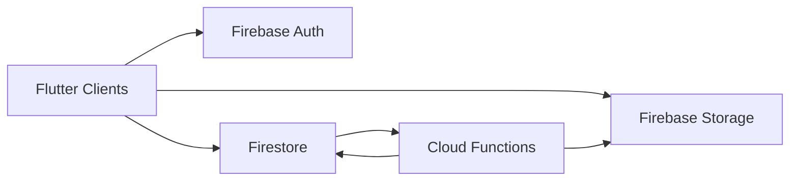
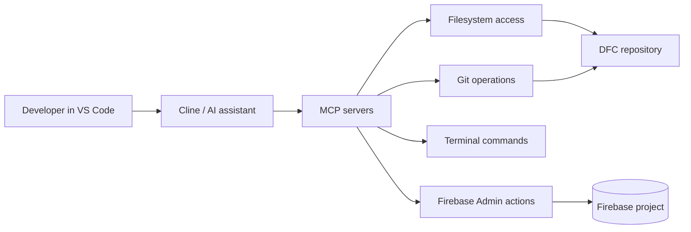

# DFC MCP Architecture Map

This document defines how MCP fits into DFC without blurring production boundaries.

## Executive summary

- **Firebase is DFC backend infrastructure** (production runtime).
- **MCP servers are local AI tooling interfaces** (developer runtime).
- MCP **never** replaces Firebase, CI, Sonar, routing guards, or branch protection.

## System boundaries

### Production path (authoritative)

### Local engineering path (assistive)

## What MCP is (and is not)

### MCP is

- A protocol layer to give local AI tools structured access to dev capabilities
- Useful for refactors, inspections, scripted checks, and controlled admin actions

### MCP is not

- A hosting platform
- A production backend runtime
- A replacement for Firebase
- A replacement for CI quality gates

## Recommended MCP server set for DFC

### 1) Firebase Admin MCP (recommended)

Use for:
- Firestore document inspection/writes in controlled workflows
- Storage inspection for media pipelines
- Firebase-admin-driven diagnostics

Guardrails:
- Principle of least privilege
- Prefer staging/test data for automation operations
- Production writes must follow documented operational controls

### 2) Filesystem MCP (recommended)

Use for:
- Reading/editing repo files
- Enforcing route constants and module standards
- Maintaining docs/rule packs

### 3) Git MCP (recommended)

Use for:
- Diffs, commits, patch preparation
- PR-oriented change hygiene

### 4) Terminal MCP (optional)

Use for:
- Analyzer/tests/validation commands
- Workflow simulation and targeted diagnostics

### 5) DFC custom MCP (optional)

Use for:
- Domain checks (routing spine, module sweep logic, feed trust checks)
- Team-specific automation primitives

## Enforcement stack (source of truth)

These controls remain authoritative regardless of local assistant/model/provider:

- `.github/workflows/ci.yml`
- `.github/workflows/quality-gate.yml`
- `.github/workflows/routing-check.yml`
- `.github/workflows/firebase-security-check.yml`
- `.github/workflows/dfc-rulepack-check.yml`
- Branch protection required checks
- `docs/DFC_SONAR_RULE_PACK.md`
- `.github/pull_request_template.md`

## Cline relationship to this map

Cline consumes MCP locally. It does not become a runtime dependency.

If paid model access is unavailable:
1. Switch to configured free fallback model
2. Continue local development
3. Open PR
4. Merge only when required checks are green

## Operational references

- `docs/QUALITY_GATE_SETUP.md`
- `docs/CLINE_USAGE_POLICY.md`
- `docs/CLINE_FREE_MODE_SETUP.md`
- `docs/DFC_OPERATOR_QUICK_CARD.md`
- `docs/DFC_MODULE_SWEEP_CHECKLIST.md`

## Decision statement

For DFC, **Firebase is backend** and **MCP is local tooling**. Keep them separate by design.
