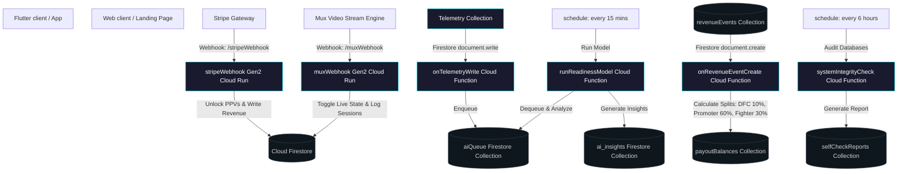

# Internal Architecture Mapping (Data Fight Central - Private)

This document maps out the core architecture of the private Data Fight Central backend. It contains proprietary flows, collection mappings, secure integrations, and execution loops designed to support a robust, live-production combat sports platform.

---

## 🗺️ High-Level System Map

---

## 📂 Core Collection Mapping & Rules

| Collection Name    | Strategy              | Description / Usage                                                                                                     |
| :----------------- | :-------------------- | :---------------------------------------------------------------------------------------------------------------------- |
| `users`            | Secure Document (UID) | Contains profile schemas, onboarding flags, and role assignments (`fan`, `fighter`, `promoter`, `admin`, `superadmin`). |
| `ppvEvents`        | Shared Collection     | Tracks digital pay-per-view matchups, stream details, `streamId`, pricing keys, and live state (`isActive`).            |
| `ppvPurchases`     | Audit Collection      | Keeps cryptographically and gateway-verified purchases mapping a `userId` to an `eventId`.                              |
| `revenueEvents`    | Economic Log          | Primary financial stream populated securely via checked webhook operations.                                             |
| `payoutBalances`   | Split Ledger          | Increment ledger aggregating raw earnings in cents allocated to DFC, promoters, or fighter pools.                       |
| `aiQueue`          | Processing Queue      | Buffer collection logging fighter telemetry waitlisted for Vertex AI/Gemini evaluation slices.                          |
| `ai_insights`      | Analytical State      | Holds compiled readiness score, fatigue indices, and injury risk projections.                                           |
| `selfCheckReports` | Integrity Auditing    | Automated reporting logs asserting system health, tracking anomalies, and flagging orphaned records.                    |

---

## 🔐 Credentials & Security Governance

- **Secret Manager Integration:** All secure API keys (PayPal, Stripe, SendGrid, Mux, Gemini) are housed in GCP Secret Manager and bound as direct env injections on necessary runtimes.
- **Write Access Guards:** Critical databases and collections have active rules asserting identity tokens; administrative functions are gated on explicit security assertions.
