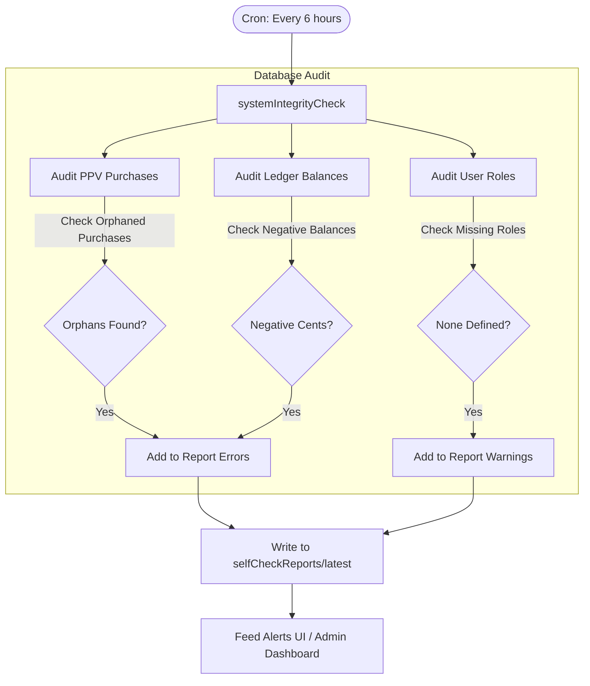

# Safety Systems Architecture (Data Fight Central - Private)

This document details the critical safety components, monitoring loops, and health evaluation engines embedded within the Data Fight Central backend.

---

## 🛡️ Health & Integrity Audits (`systemIntegrityCheck`)

Data Fight Central includes a scheduled self-healing check designed to execute every 6 hours via Cloud Scheduler. This routine programmatically audits database consistency:

These audits prevent payment leaks, ensure robust user authorization checks, and maintain account ledges above zero. For structural fixes (like removing safe orphaned data), the administrative callable function `autoFix` is exposed exclusively to verified admins in the system.

---

## 🚑 Fighter Telemetry & SOS Pathways

To ensure high-risk fighters or individuals in combat gyms have reachable safety loops:

- **Telemetry Threshold Watchers:** The analytical insights generated by the Vertex AI/Gemini processing system run critical boundary assertions. If fatigue levels exceed safe benchmarks or heart-rate readings indicate acute cardiac strain, a flagged status is instantly pinned to the user's active session document.
- **Alert Escalation Service:** If flagged, notification workers invoke Twilio/SendGrid alert paths to trigger push warnings to the gym's master dashboard, the designated trainer/coach, and emergency contacts.
- **Anonymized Audits:** To protect private medical records, raw IoT heart rates and strain markers are purged from database records after window validation, leaving only the computed statistical insights (`readinessScore`, `fatigueScore`) verified for safety profiling.
